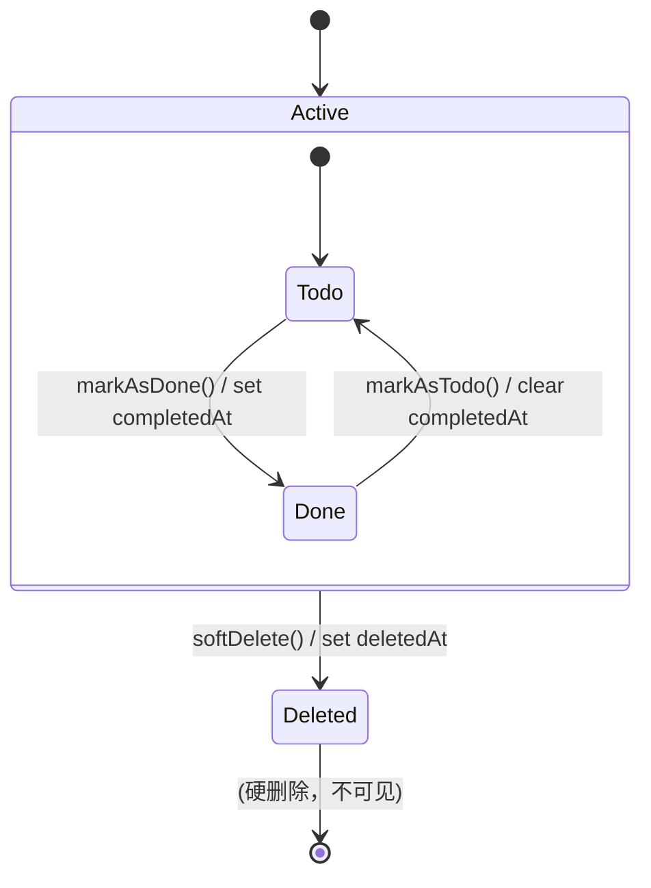

# KeepFlow 领域模型 UML

> 以下 UML 图可在 GitHub / GitLab / GitBook 等支持 Mermaid 的平台直接渲染。

---

## 1. 类图（Class Diagram）

```mermaid
classDiagram
    direction TB

    package "Domain Layer" {

        class Task {
            <<Entity>>
            +UUID id
            +String content
            +Date createdAt
            --
            +TaskStatus status
            +Date? completedAt
            +Date? deletedAt
            --
            +markAsDone() Task
            +markAsTodo() Task
            +softDelete() Task
            +isActive: Bool
            +isDone: Bool
            +isTodo: Bool
        }

        class TaskStatus {
            <<enumeration>>
            +todo
            +done
        }

        class TaskRepository {
            <<interface>>
            +save(task: Task) Void
            +findById(id: UUID) Task?
            +findAll(limit: Int) Task[]
            +findTodoTasks(limit: Int) Task[]
            +delete(id: UUID) Void
            +softDelete(id: UUID) Void
            +countByStatus(status: TaskStatus) Int
        }

        class TaskCreationError {
            <<enumeration>>
            +emptyContent
        }

        Task --> TaskStatus : status
        Task --> TaskCreationError : factory creates
    }

    package "Infrastructure Layer" {

        class TaskRecord {
            +UUID id
            +String content
            +String status
            +Date createdAt
            +Date? completedAt
            +Date? deletedAt
            +String? taskType
            --
            +toDomain() Task
            +fromDomain(task: Task) TaskRecord
        }

        class TaskRepositoryImpl {
            -dbQueue: DatabaseQueue
            --
            +save(task: Task) Void
            +findAll(limit: Int) Task[]
            +findTodoTasks(limit: Int) Task[]
            +softDelete(id: UUID) Void
        }

        TaskRepositoryImpl ..|> TaskRepository : implements
        TaskRecord --> Task : maps to
    }
```

---

## 2. 状态图（State Diagram）



---

## 3. 对象图示例（Object Diagram）

```mermaid
objectDiagram
    class Task {
        id = "550e8400-e29b..."
        content = "修复登录 Bug"
        status = "todo"
        createdAt = "2026-04-07 10:00"
        completedAt = null
        deletedAt = null
    }

    class Task {
        id = "6ga7d910-f42c..."
        content = "跟进客户需求"
        status = "done"
        createdAt = "2026-04-06 09:30"
        completedAt = "2026-04-06 14:20"
        deletedAt = null
    }

    class Task {
        id = "7hb8e021-g53d..."
        content = "整理会议记录"
        status = "todo"
        createdAt = "2026-04-05 16:45"
        completedAt = null
        deletedAt = "2026-04-07 08:00"
    }
```

---

## 4. 领域规则速查

| 规则 | 说明 |
|------|------|
| Task 是 **Entity** | 同一 UUID 的 Task 跨状态变化仍为同一实体 |
| **不可变模式** | 所有变更操作返回**新实例**，原始实例不变 |
| content 验证 | 非空、去除首尾空白，否则 `TaskCreationError.emptyContent` |
| 软删除 | `deletedAt` 非 nil 即逻辑删除，查询自动过滤 |
| completedAt | 显式存储完成时间，`markAsDone()` 时赋值 |
| 扩展点 | `taskType` (String?) — 预留，MVP 兼容 |

---

## 5. 仓储查询约定

| 方法 | 查询条件 |
|------|---------|
| `findAll(limit)` | `deletedAt IS NULL` ORDER BY createdAt DESC |
| `findTodoTasks(limit)` | `deletedAt IS NULL` AND `status = 'todo'` ORDER BY createdAt DESC |
| `softDelete(id)` | `UPDATE tasks SET deletedAt = now()` |
| `countByStatus(status)` | `deletedAt IS NULL` AND `status = ?` |
